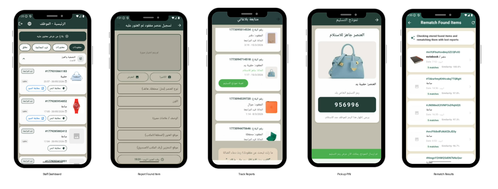

# Rawan Alqahtani

### Information Technology Graduate · AI & Data Science Track

Applied AI · Machine Learning · NLP · Computer Vision · Data Science · Research

## About

I am an Information Technology graduate from King Saud University with an **AI & Data Science track** and hands-on experience across applied AI, machine learning, NLP, computer vision, data curation, and end-to-end system development.

At **King Abdulaziz City for Science and Technology (KACST)**, I have worked on a bilingual AI-assisted food-safety system, curated and processed large product datasets, collaborated on satellite-image annotation for AI development, and contributed to an ongoing **KACST–MIT social robotics study** focused on children's social and emotional learning.

I am interested in full-time opportunities in **AI/ML, Data Science, and applied research**, especially roles that combine model development with real-world systems and careful evaluation.

## Featured Work

| Project | Focus | Highlights | Access |
| --- | --- | --- | --- |
| **[SafeBite](projects/safebite.md)** | Applied AI · OCR · LLM · Mobile/Backend | Hybrid rule-first screening pipeline, bilingual OCR, barcode lookup, conservative 3-state decisions, 22K+ product records | Private Repository |
| **[Wadi'ah](projects/wadiah.md)** | Computer Vision · Semantic Search · Full-Stack AI | MobileNetV3Small/TFLite visual retrieval, multilingual MiniLM matching, Top-5 candidates, dynamic indexing, human-in-the-loop verification | [Repository](https://github.com/Rawan806/2025_GP_18) |
| **[Jibo Social Robotics Study](projects/jibo-sel.md)** | HRI · SEL · Research Methodology | Ongoing structured behavioral measurement work for robot-supported child collaboration | In progress |
| **[Cardiovascular Disease Classification](projects/cardiovascular-risk.md)** | Machine Learning · Tabular Data | LR/SVM/RF comparison, GridSearchCV, cross-validation, final ROC-AUC 0.8015 | [Repository](https://github.com/Rawan806/ML-early-risk-prediction) |
| **[RUH Flights Big Data Analytics](projects/kkia-big-data.md)** | Big Data · Spark · Scala | 153K+ flight records, distributed analytics, Spark ML classification, data cleaning and outlier handling | [Repository](https://github.com/Rawan806/KKIA_BigData-Group4) |
| **[Saudi PDPL Legal Text Analytics](projects/pdpl-legal-text-analytics.md)** | Arabic NLP · EDA · Text Mining | Analysis of 43 legal articles, TF-IDF, comparative EDA, LLM prompting experiments | [Repository](https://github.com/Layantt/Data-Science-Project) |
| **[Emotion-Aware Humor Classification](projects/emotion-humor.md)** | NLP · Weak Supervision · ML | 200K samples; text-only vs weak-emotion features; best SVM reached 94.95% accuracy & macro-F1 | Private repository |

## Professional Experience

### AI & Software Development Intern · KACST
**Jun 2026 – Present**

- Own end-to-end development work on **SafeBite**, integrating mobile, backend, OCR, product lookup, deterministic rules, and selective LLM reasoning.
- Curated and processed **22K+ SFDA barcode records** for product lookup and enrichment workflows.
- Collaborated closely with the AI team to annotate and quality-check **200+ satellite images**, aligning on labeling guidelines and resolving ambiguous cases to maintain dataset consistency.
- Collaborate with researchers on an ongoing **KACST–MIT Jibo social robotics study**, conducting SEL literature review and developing structured behavioral measurement methods.

## Selected Project Evidence

### SafeBite
A bilingual AI-assisted food-label screening prototype for children with celiac disease. The system prioritizes structured product lookup and deterministic safety rules, uses OCR when product data is unavailable, and invokes an LLM only for unresolved readable evidence.

**Stack:** Flutter · Firebase · FastAPI · Google Cloud Vision · ML Kit · Gemini · Python

[View repository →](https://github.com/Rawan806/safebite) · [Read the SafeBite case study →](projects/safebite.md)

### Wadi'ah
Graduation project designed for the lost-and-found workflow at **Al-Masjid Al-Haram**. The system combines bilingual mobile workflows, AI-assisted multimodal retrieval, staff verification, ownership evidence review, and secure PIN-based handover.

**My contribution:** Led development across most of the end-to-end system, including the Flutter/Firebase application, FastAPI integration, multimodal retrieval pipeline, dynamic indexing, staff-side workflows, testing, and system refinement. SMS integration was handled by a teammate.

**AI pipeline:** MobileNetV3Small/TFLite visual embeddings and multilingual MiniLM text embeddings with cosine similarity, Top-5 candidate retrieval, dynamic indexing, staff-initiated rematching, and human-in-the-loop ownership confirmation.

  

<em>Selected Wadi'ah interfaces showing staff report management, found-item reporting, visitor report tracking, secure pickup PIN generation, and AI-assisted rematching.</em>

**Evaluation:** Functional testing and UAT were conducted with five participants; 100% strongly agreed that the interface was clear and easy to use, and 100% strongly agreed on overall usefulness and ease of use.

[View repository →](https://github.com/Rawan806/2025_GP_18) · [Read case study →](projects/wadiah.md)

### Cardiovascular Disease Classification
End-to-end machine learning workflow on a cardiovascular disease dataset with preprocessing, BMI feature engineering, scaling, hyperparameter tuning, and model comparison.

**Best final model:** Tuned Random Forest · **73.65% accuracy · 0.8015 ROC-AUC**

[View repository →](https://github.com/Rawan806/ML-early-risk-prediction) · [Read case study →](projects/cardiovascular-risk.md)

### RUH Flights Big Data Analytics
Big Data project built with **Apache Spark and Scala** on **153K+ flight records**, covering distributed preprocessing, RDD analytics, Spark SQL, and machine learning.

**My contribution:** Independently implemented the Spark ML phase, including feature preparation, Random Forest training, baseline comparison, model evaluation, and interpretation. Also contributed to data cleaning, outlier handling, and refinement of earlier processing stages.

[View repository →](https://github.com/Rawan806/KKIA_BigData-Group4) · [Read case study →](projects/kkia-big-data.md)

### Saudi PDPL Legal Text Analytics
Team data-science project analyzing Saudi Arabia's Personal Data Protection Law. The project collected **43 legal articles** and applied Arabic text preprocessing, EDA, TF-IDF, frequency analysis, and LLM-based Q&A experiments.

**My contribution:** Exploratory data analysis, comparative analysis, interpretation and communication of results, and development of Gemini-based Q&A generation experiments comparing zero-shot, one-shot, and few-shot prompting for Arabic legal text understanding.

[View team repository →](https://github.com/Layantt/Data-Science-Project) · [Read case study →](projects/pdpl-legal-text-analytics.md)

### Emotion-Aware Humor Classification
My modeling work tested whether **weak emotion labels add useful signal to humor classification**. On a balanced **200,000-sample** dataset, I compared TF-IDF text-only baselines against text + one-hot weak-emotion features using Logistic Regression, Multinomial Naive Bayes, and Linear SVM.

**Best result:** Linear SVM + weak emotion · **94.95% accuracy · 94.95% macro-F1**

[Read case study →](projects/emotion-humor.md)

## Technical Skills

| Area | Technologies |
| --- | --- |
| **Programming** | Python, SQL, Java, JavaScript, Scala |
| **AI & Data** | Machine Learning, Deep Learning, NLP, Computer Vision, scikit-learn, TensorFlow, Pandas, NumPy, LLM workflows |
| **Analytics & Big Data** | EDA, Data Cleaning, Feature Engineering, Model Evaluation, TF-IDF, Apache Spark, Excel, Power BI |
| **Development** | FastAPI, Flutter, Firebase, REST APIs |
| **Tools** | Git, GitHub, Jupyter, Google Colab, VS Code, Linux / Ubuntu |

## Resume

[View / download my resume](assets/RawanAlqahtani_CV.pdf)

## Contact

- **GitHub:** [Rawan806](https://github.com/Rawan806)
- **LinkedIn:** [Rawan Alqahtani](https://www.linkedin.com/in/rawan-alqahtani-6901b02a7/)
- **Email:** [rawanalq88@gmail.com](mailto:rawanalq88@gmail.com)
